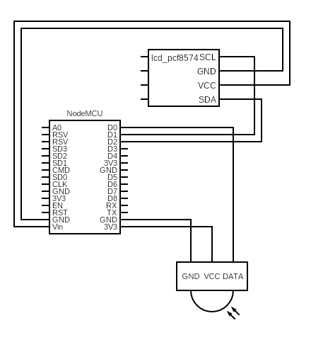

# Cigarette Counter – ESPHome Project

Keep track of every cigarette smoked and visualize the estimated **life‑time lost** in real‑time on a 16×2 LCD. The node publishes its data to Home Assistant and displays a running counter locally.

---

## ️Hardware

| Part                            | Notes                                             |
| ------------------------------- | ------------------------------------------------- |
| NodeMCU v2 (ESP8266)            | 1 ×                                               |
| IR proximity sensor             | Wired to `D0` (GPIO16)                            |
| I²C 16×2 LCD (PCF8574 backpack) | `SCL → D1` (GPIO5), `SDA → D2` (GPIO4), 5 V power |
| 5 V USB supply                  | Stable power source                               |

> 💡 The wiring matches the default pins in `cigarette-counter.yaml`. Change them there if you use different pins.

---

## Pinout view



---

## Getting started

1. **Clone / download** this repository.

2. **Review `cigarette-counter.yaml`** and replace:

   * `wifi:` SSID & password
   * `fallback hotpost:` Password
   * `Pins:` Check and change the pins as required

3. **Flash** the NodeMCU with ESPHome:

   ```bash
   esphome run cigarette-counter.yaml
   ```

4. **Add the node** in Home Assistant → *Integrations* (it should be auto‑discovered).

5. **Create/confirm** the counter entity:

   ```yaml
   counter:
     cigarette_s_smoked:
       initial: 0
       restore: true
       step: 1
   ```

6. **Create the Home Assistant automation to increment the counter**

    ```yaml
    alias: Increment Cigarette Counter
    description: ""
    triggers:
    - trigger: state
        entity_id:
        - binary_sensor.cigarette_proximity_sensor
        to: "off"
    conditions: []
    actions:
    - action: counter.increment
        metadata: {}
        data: {}
        target:
        entity_id: counter.cigarette_s_smoked
    mode: single
    ```

7. Place the sensor where cigarettes are removed – each removal held >5 s will trigger a count.

---

## How the “life lost” is computed

```text
life‑lost‑minutes = cigarettes × 20

days  = life‑lost‑minutes / 1440
hours = (life‑lost‑minutes % 1440) / 60
```

Feel free to adjust the multiplier in `lambda:` if you prefer another health metric.

---